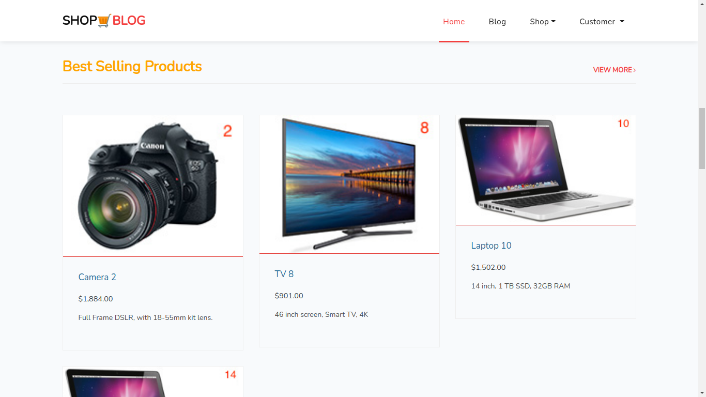
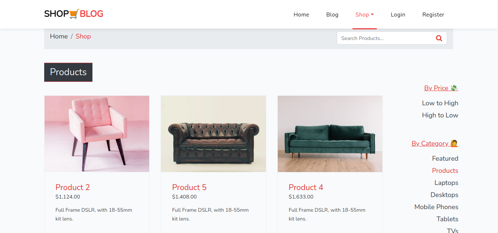
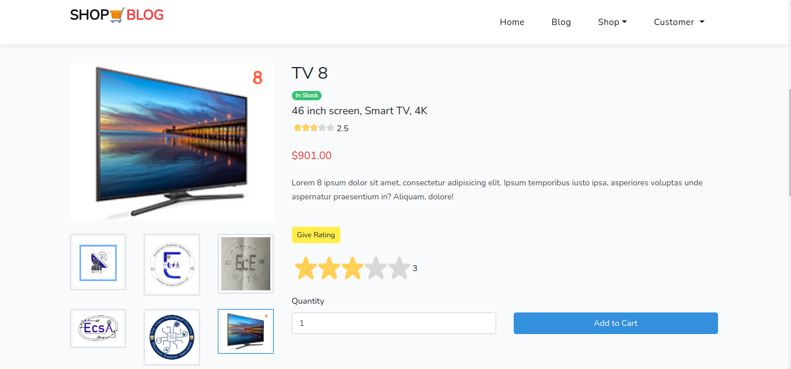
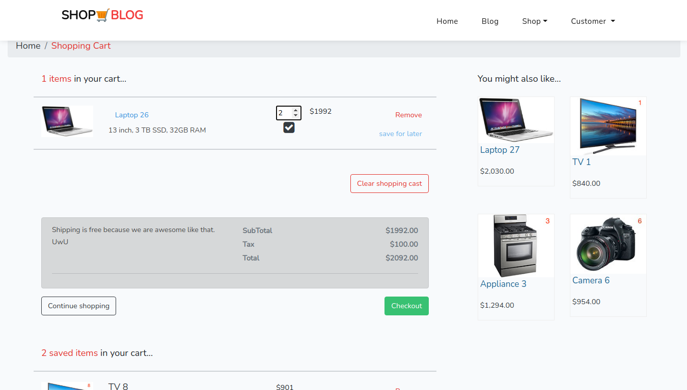
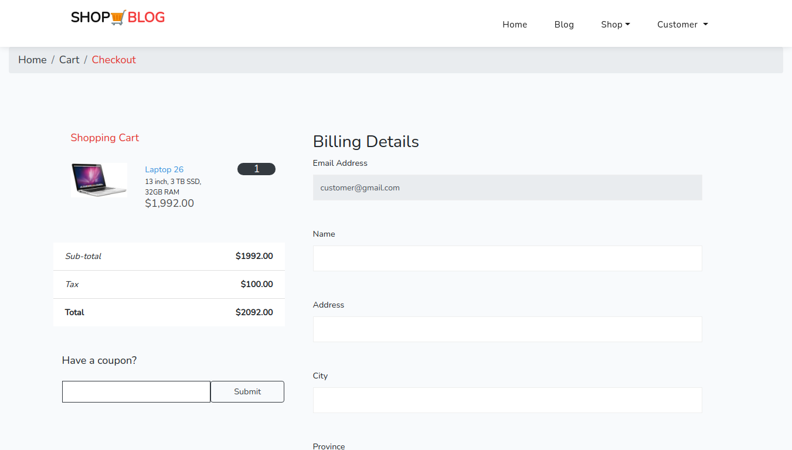
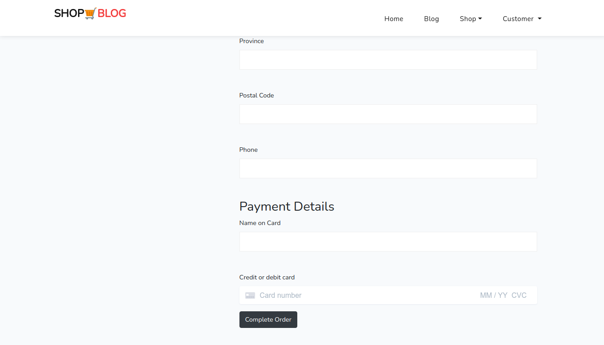
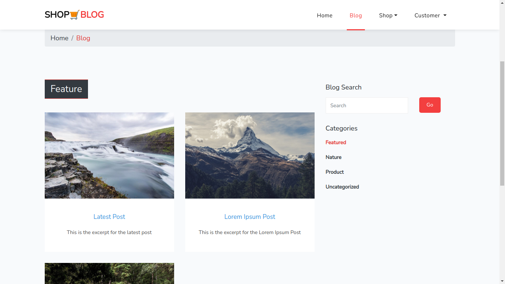
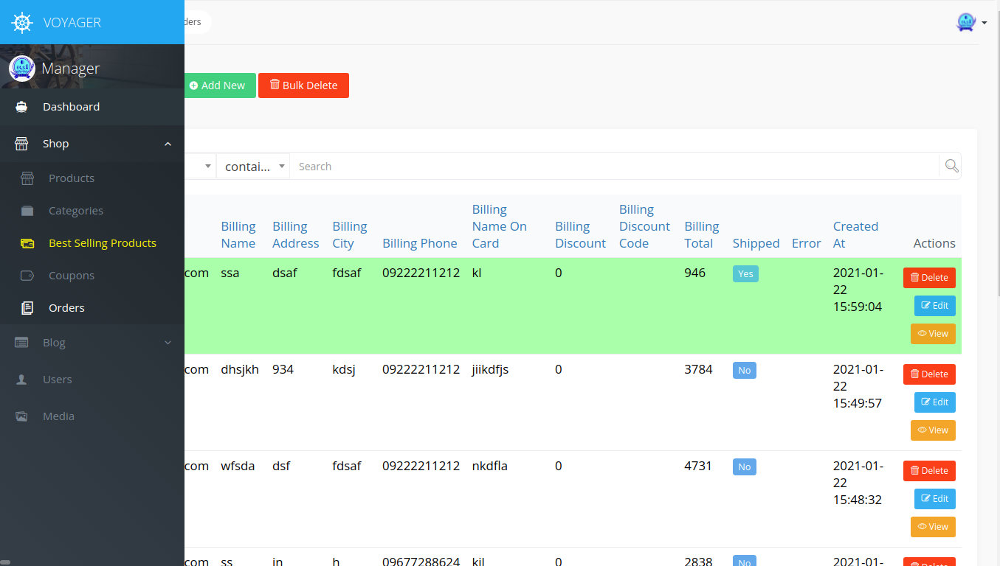
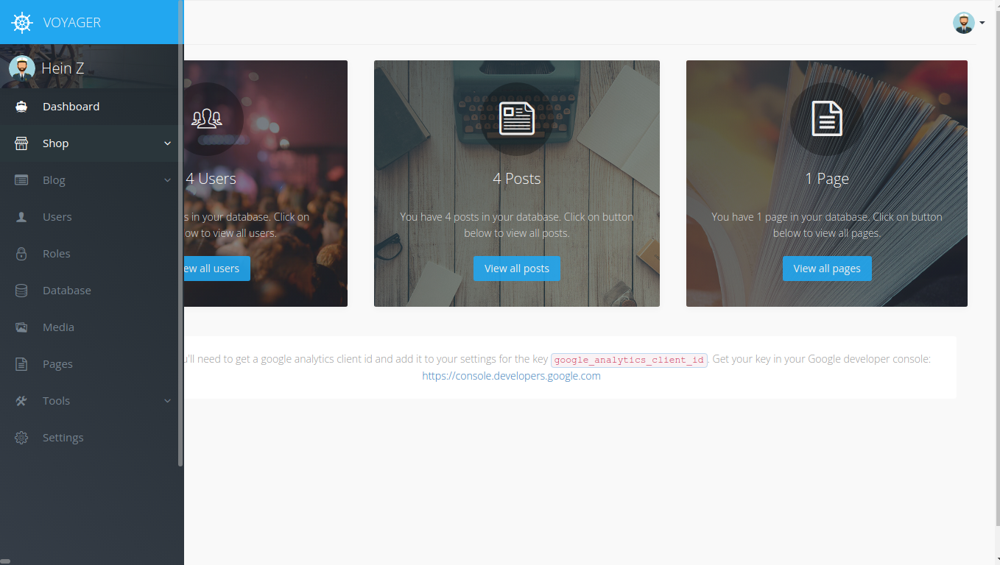

## What I learnt

- Vue js api
- Laravel
- <a href="https://voyager-docs.devdojo.com">voyager</a>
- <a href="https://stripe.com/docs/js">Stripe js</a>
- testing with PHP unit
- Paypale che ckout
- Transaction Email
- <a href="https://packagist.org/packages/hardevine/shoppingcart">Laravel shopping cart</a>

## Core Feature

- Payment checkout
- Single page dynamic shopping cart (with saves for later feature) UX using vue js api
- single page products search
- product details with image gallery
- automatic calculated bills
- discount with coupon code
- admin backend with laravel voyager
- admin management (order, products, blog, categories, user etc...)
- product category and arrange with price (low to high or high to low)
- dynamic product images gallery
- allow guest checkout
- authentication
- feature product
- best selling products
- give rating stars to product
- blog (posts with categories)

## Screenshot

- Home Page

- Shop Page

- Product Details Page

- Shopping Cart Page

- Checkout Page

- Blog Page

- Voyager Admin Panel

for manager assessment

for admin assessment

## coming soon

- user dashboard

## manager account

- manager@gmail.com
- password

## admin account

- admin@gmail.com
- password

